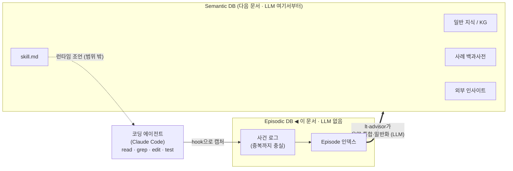
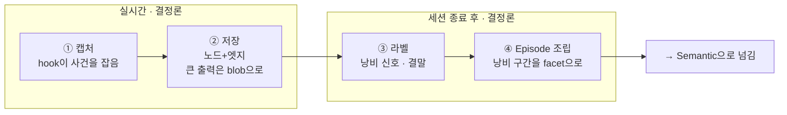
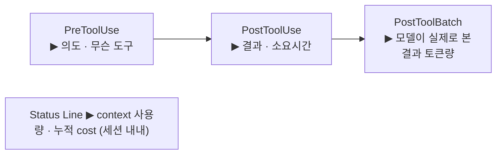
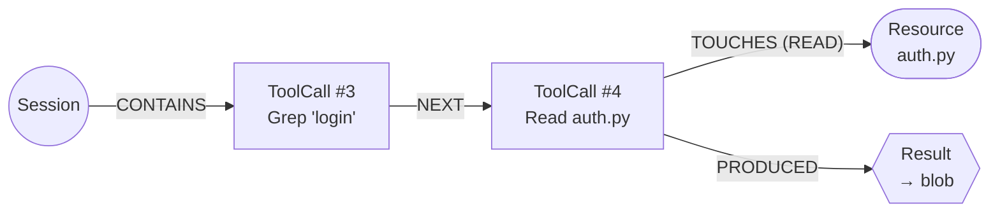
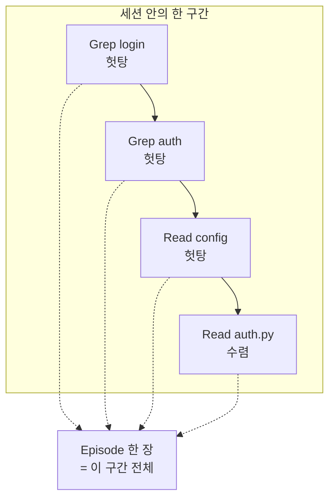

# Episodic DB 로그 구현 명세 (v0.3)

---

## 0. 개요

코딩 에이전트(Claude Code)가 일할 때 **뭘 했고 뭘 낭비했는지 기억하는 메모리 - Context Memory**

- **Episodic DB** — "언제·뭘 했나"의 **사건 기록**.
- **Semantic DB** — 그 사건들을 추상해 만든 **일반 지식** + 외부 인사이트 + **skill.md**.

**Episodic은 사건을 "있는 그대로, 중복까지 충실히" 저장한다. 요약·통합·일반화는 여기서 하지 않는다** (그건 전부 Semantic이 한다).

> 모든 라벨은 threshold 분류·그래프 순회·텍스트 추출 같은 결정론 연산으로만 만든다. LLM이 필요한 작업(요약·의미 일반화·임베딩)은 전부 Episodic 밖, Semantic DB의 몫이다.

---

## 1. 큰 그림: Episodic이 전체에서 어디 있나



**요약:** 에이전트가 일하면 → 사건이 Episodic에 결정론으로 쌓이고 → lt-advisor가 그걸 추상해 Semantic(skill.md 포함)을 만들고 → 그 skill.md가 다음 실행에 조언한다.

> **LLM 경계선은 Episodic 박스 바깥이다.** Episodic 안(캡처·저장·라벨·Episode 조립)은 전부 결정론. lt-advisor/LLM은 Semantic으로 넘어간 뒤부터 작동한다.

---

## 2. 데이터가 흐르는 방식 (4단계)

Episodic 내부는 4단계다. 앞 둘은 실시간(사건 발생 즉시), 뒤 둘은 세션이 끝난 뒤다. **네 단계 모두 LLM 없음.**



- **① 캡처** — "무슨 도구를, 무슨 의도로, 결과는?" 을 즉시 기록.
- **② 저장** — 사건을 노드/엣지로. 큰 출력(pytest 로그 등)은 blob에 빼고 핸들만.
- **③ 라벨** — 세션이 끝나야 아는 것: "문제해결에 도움된 Call이었나", "낭비한 token의 숫자". (전부 그래프/산수)
- **④ Episode 조립** — 낭비 구간을 묶어 검색용 **facet**을 붙인다.

---

## 3. ① Capture — 어디서 무엇을 잡나

도구를 한 번 쓸 때마다 훅이 여러 지점에서 발동한다. 지점마다 잡는 게 다르다.



| 위치 | 무엇을 잡나 | 왜 중요 |
|---|---|---|
| **PreToolUse** | 도구 이름, 입력, 무엇을 건드리려는지 | "의도" |
| **PostToolUse** | 결과 hash, 출력 크기·토큰, 걸린 시간 | "실제 결과" |
| **PostToolBatch** | *모델이 다음 턴에 실제로 본* 결과 토큰 | **context가 부푸는 진짜 측정점** |
| **Status Line** | context 사용량, 누적 비용 | 세션 단위 눈덩이·cost 추적 |

> token은 추정치가 아니라 **정확한 4종 카운트**(input / output / cache_creation / cache_read)로 잡는다. 자세한 필드는 부록 C.

---

## 4. ② 저장 & ③ 라벨

### 4.1 사건을 노드/엣지로 저장



> 같은 파일을 3번 읽으면 노드 **3개**로 저장한다. 합치지(dedup) 않는다. "3번 읽었다"는 사실 자체가 낭비 신호라서, 합치는 순간 그 신호가 사라지기 때문이다. 통합은 나중에 Semantic이 한다.

저장소는 **Postgres 노드/엣지 테이블**로 저장된다.

### 4.2 세션이 끝난 뒤 붙는 라벨 (전부 결정론)

| 라벨 | 무엇 | 어떻게 (LLM 없음) |
|---|---|---|
| **기여 여부** (`contributed_to`) | 이 호출이 최종 성공에 닿았나 | **patch에서 거꾸로 그래프 도달성 추적** (tier1). 닿으면 CONTRIBUTED, 아니면 DID_NOT |
| **낭비 신호** | 얼마나 낭비했나 | 아래 metric으로 산수·해시비교 (부록 E) |
| **결말(outcome)** | 이 구간이 어떻게 끝났나 | `converged`(수렴) / `abandoned`(포기) / `looped`(무한루프) |

낭비 신호 = `새정보 비율` · `무의미 반복 점수` · `같은 파일 재read 비율` · `턴당 context 증가량`. (정확한 공식은 부록 E)

> **`contributed_to`가 LLM 없이 되는 이유:** 세션이 끝나면 최종 patch가 어떤 자원을 `WROTE`했는지 이미 안다. "이 호출이 기여했나?"는 판단이 아니라 **"patch 자원에서 거꾸로 도달하나?"의 그래프 질문**이 된다. 순수 순회. — "이해는 도왔지만 patch엔 안 닿은" 호출을 헛수고로 오판하는 거친 부분이 있지만, direction-level 조언엔 이 정도로 충분하다(정밀 재실행 검증은 강등).

---

## 5. ④ Episode — v0.3의 새 중심

### 5.1 Episode란?

낱개 호출은 너무 잘고("Read auth.py 하나"는 교훈이 안 됨), 세션 전체는 너무 크다. 검색과 재료의 자연스러운 단위는 그 중간 — **"하나의 낭비 사건"** = **Episode**다.



낭비는 앞 3개(헛탕)이고 4번째에서 수렴했다. 이 구간 전체가 **Episode 한 장**이 된다. 경계 찾기(segmentation)는 `CONTRIBUTED`를 구분자로, `WROTE`(edit)에서 끊고, 수렴 못 하면 세션 끝에서 강제 종료 — 전부 `NEXT` 체인 순회라 **LLM 없음.**

### 5.2 signature — 결정론 facet으로 검색한다

Episode를 나중에 찾는 방법 = **signature(검색용 태그 묶음).** 전부 **로그에서 추출한 구조적 값**이라 LLM이 필요 없고, SQL 한 줄로 즉시 검색된다.

**왜 `task_type`("auth 버그" 같은 의도 라벨)이 아니라 facet인가:**
의도 라벨은 grep 쿼리·경로에서 *추측*해야 해서 본질적으로 LLM이 필요하다(로그에 숫자로 안 박혀 있음). 그래서 **task_type을 만드는 대신, 관측된 자원 facet들을 그대로 박는다:**

| facet | 무엇 | 어떻게 추출 (LLM 0) |
|---|---|---|
| `converged_resource` | 수렴점 자원 | 그래프 (CONTRIBUTED 구분자) |
| `touched_paths` | 건드린 경로들 | TOUCHES 엣지 |
| `path_prefix` | 경로들의 최장공통 prefix | 문자열 연산 |
| `changed_symbols` | 바뀐 함수/클래스명 | git diff 파싱 |
| `test_names` | fail→pass된 테스트 | 테스트 결과 대조 |
| `grep_terms` | 정규화된 검색 토큰 | 쿼리 토크나이즈 |
| `error_signature` | 에러 클래스+메시지 골격 | 정규화 |

**retrieval은 "auth 버그 사례" 문자열 매칭이 아니라 이 facet들의 겹침으로 한다.** `path_prefix='auth/'` 하나가 `task_type='bugfix/auth'`가 하려던 일을 대신하는데, 추측이 아니라 관측이라 더 정확하고 공짜다.

```sql
-- "이거랑 비슷한 사례 찾아줘" = facet 교집합 (LLM/임베딩 없이)
SELECT episode_id, waste_type, converged_resource
FROM episodes
WHERE path_prefix = 'auth/'
   OR converged_resource = ANY(:후보_자원들)
   OR grep_terms && ARRAY['login','auth','expiry'];   -- 배열 교집합
```

> **facet의 한계와, 그걸 메꾸는 게 Semantic인 이유:** 경로 이름이 의미를 안 담거나(`utils/helpers.py`), repo가 달라 `auth/` ↔ `identity/`처럼 이름만 다른 경우는 facet만으로 못 잇는다. "의미는 같은데 이름이 다른" 사례를 잇는 **임베딩(의미 유사도) 검색은 Semantic DB의 몫**이다. Episodic은 결정론 facet 검색까지만 하고, 자연어 요약·벡터는 만들지 않는다.

### 5.3 낭비 유형(waste_type)은 정해진 목록에서 threshold로 고른다

`futile-exploration`(헛탕) · `read-heavy` · `context-snowball` · `repeated-loop` · `expensive-failure`.

각각 이미 계산된 metric을 threshold `if-else`에 넣어 분류한다(부록 E). **판단이 아니라 조회** — LLM 없음. 재료 metric도 전부 토큰 합산·해시 비교·카운팅이라 결정론이다.

### 5.4 Episodic엔 LLM이 없다 (정리)

Episodic의 모든 산출물은 결정론 경로로만 만든다:

| 작업 | 방법 | LLM |
|---|---|---|
| segmentation (구간 묶기) | NEXT 체인 순회, CONTRIBUTED 구분자 | ❌ |
| contributed_to | patch 역방향 도달성 | ❌ |
| waste_type | threshold 분류 | ❌ |
| signature facets | 로그 텍스트 추출 (경로·diff·테스트·grep) | ❌ |
| cost/metric | 정확 토큰 합산·비율 | ❌ |

LLM은 Episodic 밖에서만 등장한다 — Semantic으로 넘어간 뒤 lt-advisor가 자연어 요약·의미 일반화·임베딩을 할 때부터.

> **남는 결정론의 거친 부분 (감수):** segmentation은 "서로 다른 목표가 한 연쇄에 섞인 경우"(auth 찾다 db로 갈아탐)를 한 Episode로 오접합할 수 있다. 드물고 direction-level 조언엔 치명적이지 않아 지금은 감수한다. 정밀 분리가 필요해지면 그때 Semantic 층에서 보강한다(Episodic은 건드리지 않음).

[ Task: add embedding to the Episode record ]

Add an `embedding` field to the Episode record (the SessionEnd-assembled cluster
of exploration calls). Implement as follows:

- Granularity: generate the embedding at the EPISODE level only — never per
  tool-call / per-log.

- embedding_source (what to embed): serialize ONLY the semantic facets from
  `signature` into a single text string, in this fixed order:
    waste_type, outcome, task_type(if present), lang, path_prefix,
    converged_resource, grep_terms, changed_symbols, test_names, error_signature
  Example:
    "futile-exploration | converged | python | auth/ | conv=auth/session.py |
     grep(login,authenticate,expiry) | changed(check_expiry,Session) |
     test(test_session_expiry) | err(AssertionError:token-expiry)"
  Do NOT include numeric facets (cost_rollup, metrics) in the embedding text —
  those stay as SQL columns for filtering/aggregation.

- Embedder: use a pluggable commercial embedding API (e.g. OpenAI
  text-embedding-3-small, 1536-dim). Make the model/dim configurable; store the
  embedder name + dim alongside the vector so re-embeds are traceable.

- Storage: Postgres + pgvector. Add an `embedding vector(1536)` column on the
  `episodes` table (same row as the episode). Do NOT write the vector into the
  raw JSONL — it is a derived artifact, generated after the episode is assembled.

- Pipeline placement: run embedding generation as a step AFTER SessionEnd episode
  assembly (signature must already be populated). Keep it idempotent: re-running
  regenerates the vector from embedding_source.

- Index: create an ANN index (HNSW) on the embedding column for similarity search.

[ Retrieval it enables ]
- Vector search returns episode_id (+ that row's SQL facets), NOT the details.
  The caller must fetch the original episode/log by id for full content.
- Support combining SQL filters with vector similarity in one query, e.g.:
    SELECT episode_id, signature, cost_rollup
    FROM episodes
    WHERE path_prefix = 'auth/' AND is_wasteful = true
    ORDER BY embedding <=> $query_vec
    LIMIT 5;
- Primary consumer: LT Advisor (offline). Do not put vector search on the ST
  real-time path.

[ Out of scope for now ]
- No task_type-based logic yet (reserve `task_type: null` in signature; don't
  block on it).
- Don't embed partial/live trajectories (ST real-time) in this task.


---

## 6. 구현 로드맵

1. **캡처 훅** — Pre/Post/PostToolBatch/StatusLine에서 사건 기록 + 정확 토큰 + exec_env + blob 핸들. (부록 C)
2. **저장** — Postgres 노드/엣지, 중복 보존. (부록 A·B)
3. **라벨** — contributed_to(patch 역추적) + 낭비 신호 + 결말 태그. LLM 0.
4. **Episode 조립** — 낭비 구간 묶기 → signature facet 추출. LLM 0. (부록 D·E)
5. **Semantic으로 넘김** — 자연어 요약·임베딩·의미 일반화는 전부 Semantic DB(lt-advisor)에서. Episodic은 facet까지만 공급.

---
---

# 부록 (정확한 스키마 · 저장 값 · JSON)

본문이 "왜"였다면 부록은 "정확히 무엇"이다.

## 부록 A. 노드 스키마

| 노드 | 의미 | 핵심 필드 |
|---|---|---|
| `Session` | 한 task 실행 | `session_id`, `success`, `total_tokens`, `total_cost` |
| `ToolCall` | 도구 호출 1건 | `tool_use_id`, `seq`, `model`, `tool_name`, `input_hash`, `hook_stage`, `exec_env`, `cost`(정확 토큰), `contributed_to`, `is_wasteful` |
| `Resource` | 건드린 대상 | `resource_id`, `kind`(path\|test\|git_ref), `valid_from`, `valid_to` |
| `Result` | 관찰된 결과 | `result_hash`, `digest_handle`(→blob), `model_visible_tokens`, `is_error`, `stop_reason` |
| `Episode` | 낭비 구간 (파생) | `episode_id`, `signature`(facet), `member_tool_use_ids[]`, `converged_by`, `outcome`, `cost_rollup`, `metrics`, `waste` |

> `Session`·`Episode`에 자연어 `task_type`/`case_summary`/`embedding` 필드는 **없다** — Episodic은 결정론 facet만 저장한다.

## 부록 B. 엣지 스키마

| 엣지 | 방향 | 시제 | 생성 |
|---|---|---|---|
| `CONTAINS` | Session→ToolCall | forward | 캡처 |
| `NEXT` | ToolCall→ToolCall | forward | 캡처 |
| `TOUCHES` (READ\|WROTE) | ToolCall→Resource | forward | 캡처 |
| `PRODUCED` | ToolCall→Result | forward | 캡처 |
| `DUPLICATE_OF` (부수) | ToolCall→ToolCall | forward | 캡처 |
| `CONTRIBUTED_TO` / `DID_NOT` | ToolCall→Outcome | backward | SessionEnd (그래프 도달성) |
| `MEMBER_OF` | ToolCall→Episode | backward | SessionEnd |
| `TOUCHES_OBSERVED` | ToolCall→Resource | backward | SessionEnd (coverage.json) |

**Resource 유효기간 규칙(bi-temporal):** 어떤 파일의 `READ` 결과는 그 파일에 다음 `WROTE`가 찍히기 전까지 유효. 캐시 재사용 전 이 창으로 오래된 값(stale)인지 확인. 모순 시 옛 값은 지우지 않고 유효기간만 닫음(감사 보존).

## 부록 C. ToolCall 사건 record (JSON)

```json
{
  "session_id": "flask-auth-bug-7c3a",
  "tool_use_id": "toolu_aa19",
  "seq": 19,
  "model": "claude-opus-4-6",
  "timestamp": "2026-06-12T10:04:11Z",
  "hook_stage": "consolidated",

  "exec_env": {
    "cwd": "/workspace/flask-app",
    "platform": "linux",
    "python": "/usr/bin/python3.12",
    "git_branch": "main",
    "git_head": "e4f1a02",
    "git_dirty": true,
    "repo": "acme/flask-app",
    "cc_version": "2.1.172.562",
    "entrypoint": "sdk-cli"
  },

  "action": {
    "tool_name": "Edit",
    "normalized_input": "edit auth/session.py: token expiry check",
    "input_hash": "sha3:9f2...",
    "duplicate_of_candidate": null,
    "touches_declared": [{ "resource": "auth/session.py", "mode": "WROTE" }]
  },

  "cost": {
    "tokens": {
      "input_tokens": 2,
      "output_tokens": 310,
      "cache_creation_input_tokens": 180,
      "cache_read_input_tokens": 18400
    },
    "by_type": {
      "input_cost": 0.00001,
      "output_cost": 0.00775,
      "cache_write_cost": 0.00113,
      "cache_read_cost": 0.0092,
      "total_cost": 0.01809
    },
    "derived": {
      "own_cost": 0.00889,
      "carry_cost": 0.0092,
      "carry_ratio": 0.508
    },
    "occupancy_pct": 9.2,
    "latency_ms": 3120.5
  },

  "st_pred": {
    "pred_cost": 0.012,
    "is_high_cost": false,
    "suggested_alternative": null
  },

  "result": {
    "result_hash": "sha3:c1d...",
    "digest_handle": "ctx://blob/...",
    "is_error": false,
    "stop_reason": "tool_use",
    "model_visible_tokens": 42,
    "cost_error": 0.508
  },

  "edges_forward": {
    "next": "toolu_aa20",
    "touches": ["auth/session.py"]
  },

  "episode_labels": {
    "duplicate_of": null,
    "contributed_to": {
      "target": "outcome:flask-auth-bug-7c3a:success",
      "via": ["auth/session.py"],
      "credit_method": "tier1_causal"
    },
    "episode_id": null,
    "touches_observed": ["auth/session.py"],
    "is_wasteful": false,
    "marginal_waste": { "own": 0.0, "projected_carry_drag": 0.0 },
    "labeled_at": "session_end"
  }
}
```

> `action`/`cost`/`result`는 캡처 즉시 결정론으로 채워짐. `lt_labels`는 처음엔 null로 태어나 SessionEnd가 그래프 순회로 덧씀. (`lt_labels`는 필드명일 뿐, LLM이 아니라 SessionEnd의 결정론 단계다.)

## 부록 D. Episode record (JSON)

같은 세션에서 이 Edit 직전의 **탐색 구간**을 한 Episode로 묶은 예. token은 멤버들의 **정확한 합**, signature는 전부 **로그에서 추출한 facet**, 자연어 요약·임베딩 필드는 **없음**.

```json
{
  "episode_id": "ep_04",
  "session_id": "flask-auth-bug-7c3a",
  "member_tool_use_ids": ["toolu_aa15", "toolu_aa16", "toolu_aa17", "toolu_aa18"],
  "converged_by": "toolu_aa18",

  "env": {
    "repo": "acme/flask-app",
    "lang": "python",
    "platform": "linux",
    "model": "claude-opus-4-6",
    "git_head": "e4f1a02",
    "cc_version": "2.1.172.562"
  },

  "signature": {
    "waste_type": "futile-exploration",
    "outcome": "converged",
    "converged_resource": "auth/session.py",
    "touched_paths": ["auth/session.py", "auth/models.py", "config.py"],
    "path_prefix": "auth/",
    "changed_symbols": ["check_expiry", "Session"],
    "test_names": ["test_session_expiry"],
    "grep_terms": ["login", "authenticate", "expiry"],
    "error_signature": "AssertionError:token-expiry",
    "lang": "python",
    "tool_mix": { "grep": 2, "read": 2, "edit": 0 }
  },

  "cost_rollup": {
    "tokens": {
      "input_tokens": 8,
      "output_tokens": 640,
      "cache_creation_input_tokens": 520,
      "cache_read_input_tokens": 61200
    },
    "own_cost": 0.0193,
    "carry_cost": 0.0306,
    "total_cost": 0.0499,
    "carry_ratio": 0.613
  },

  "metrics": {
    "read_output_token_ratio": 0.78,
    "new_information_rate": 0.25,
    "repeated_read_rate": 0.0,
    "futility_score": 0.55
  },

  "waste": {
    "is_wasteful": true,
    "wasted_member_ids": ["toolu_aa15", "toolu_aa16", "toolu_aa17"],
    "wasted_own_cost": 0.0121,
    "wasted_carry_cost": 0.0217,
    "wasted_tokens": 43800
  }
}
```

> `signature`의 모든 facet은 로그에서 추출한 결정론 값이다. retrieval은 이 facet들의 교집합(§5.2 SQL)으로 하고, 자연어/의미 검색은 Semantic DB로 넘긴다.

## 부록 E. waste_type 분류 threshold + metric 공식

```yaml
large_read_output:   { chars: 4000,  lines: 80,  est_tokens: 1000 }
severe_read_output:  { chars: 20000, lines: 400, est_tokens: 5000 }
read_heavy:          { min_tool_calls: 10, warn_ratio: 0.60, severe_ratio: 0.70 }
repeated_loop:       { window_tool_calls: 20, warn_count: 2, severe_count: 3 }
context_snowball:    { consecutive_turns: 3, used_pct_warn: 50, used_pct_severe: 70 }
expensive_failure:   { same_failure_warn: 2, same_failure_severe: 3 }
futile_exploration:  { min_tool_calls: 25, no_new_info_calls: 8, no_edit_after: 15 }
```

```
read_output_token_ratio = Σ output_tokens[read,search] / Σ output_tokens[all]
context_growth_per_turn = total_input_tokens[t] - total_input_tokens[t-1]
repeated_read_rate      = 반복된 파일·범위 read 수 / max(read 호출 수, 1)
new_information_rate     = 새 정보(파일·범위·에러·diff)를 준 호출 수 / 전체 호출 수
                          (판정은 result_hash·input_hash 대조 — 해시 비교, LLM 없음)
futility_score          = 가중합(무새정보, 반복명령, 반복실패,
                                 진전없는 context 증가, cost 소모율)
```

> threshold는 고정 상수라 repo/task마다 안 맞을 수 있다. 나중에 repo별 튜닝은 **분위수 통계**로 하지 LLM으로 하지 않는다(결정론 경로 유지).

## 부록 F. 설계 계보 (related work)

- **ExpeL** (2308.10144) — trace에서 insight 추출, 파라미터 업데이트 없음.
- **Agent Workflow Memory** (2409.07429) — trajectory에서 재사용 routine induction.
- **Zep / Graphiti** (2501.13956) — temporal knowledge graph, bi-temporal·entity resolution. "통합은 Semantic에서" 근거.
- **SWE-Pruner** (2601.16746) — context pruning. read-heavy·76.1% read 근거.
- **AgentDiet** (2509.23586) — trajectory 내 불필요 정보, input token 39.9~59.7% 절감.
- **SWE-Effi** (2509.09853) — token 눈덩이·비싼 실패 지적.
- **More with Less** (2510.16786) — turn 수가 비용 드라이버.